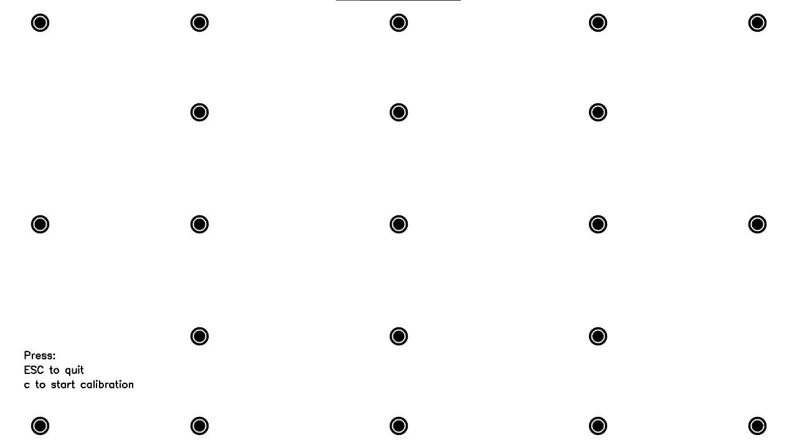
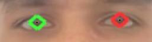
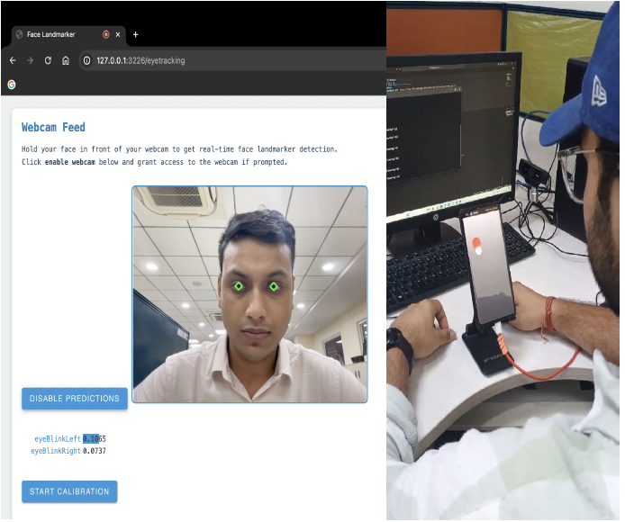
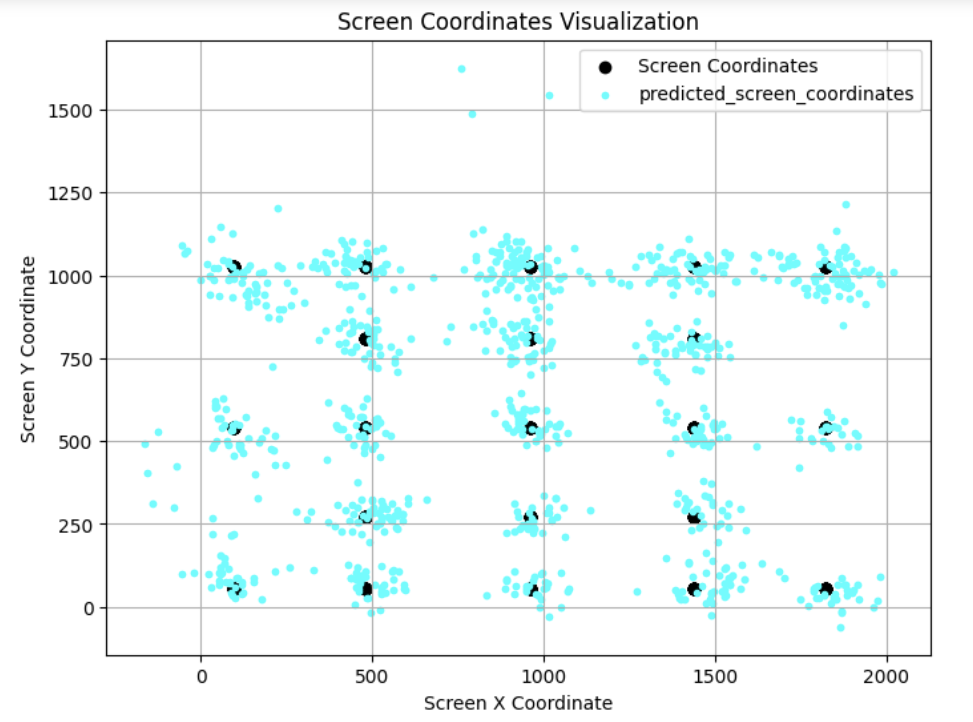

# 🎯 Gazer: Real-Time Webcam-Based Eye Tracking

[](https://www.python.org/downloads/)
[](https://opensource.org/licenses/MIT)
[](https://flask.palletsprojects.com/)
[](https://mediapipe.dev/)

A cost-effective, accessible eye-tracking solution using standard webcams and machine learning for real-time gaze estimation. Achieves **~89% accuracy** without requiring specialized hardware.

<p align="center">
  
</p>

> 📄 **Research Paper**: This project is based on our IEEE ICCCNT 2024 publication:  
> *"Real-Time Webcam-Based Eye Tracking for Gaze Estimation: Applications and Innovations"*

---

## ✨ Features

- **No Special Hardware** - Works with any standard webcam
- **Real-Time Tracking** - Low-latency gaze prediction using WebSockets
- **Cross-Platform** - Runs on desktop and mobile browsers
- **High Accuracy** - ~89% accuracy with proper calibration
- **Head Movement Compensation** - Combines pupil and head tracking
- **Blink Detection** - Filters out invalid data during blinks

---

## 🏗️ Architecture

```
┌─────────────────┐     ┌──────────────────┐     ┌─────────────────┐
│                 │     │                  │     │                 │
│  Webcam Feed    │────▶│  MediaPipe       │────▶│  Flask Server   │
│  (Browser)      │     │  Face Landmarker │     │  (Python)       │
│                 │     │                  │     │                 │
└─────────────────┘     └──────────────────┘     └────────┬────────┘
                                                          │
                        ┌─────────────────────────────────┘
                        │
                        ▼
┌───────────────────────────────────────────────────────────────────┐
│                     ML Pipeline                                    │
│  ┌─────────────┐    ┌─────────────┐    ┌─────────────────────┐   │
│  │ Pupil SVR   │───▶│  Stacking   │───▶│  Weighted Average   │   │
│  │ Base Model  │    │  (Linear)   │    │  (1.5×pupil+0.5×head)│   │
│  └─────────────┘    └─────────────┘    └──────────┬──────────┘   │
│  ┌─────────────┐    ┌─────────────┐               │              │
│  │  Head SVR   │───▶│  Stacking   │───────────────┘              │
│  │ Base Model  │    │  (Linear)   │                              │
│  └─────────────┘    └─────────────┘                              │
└───────────────────────────────────────────────────────────────────┘
                        │
                        ▼
              ┌─────────────────┐
              │  Gaze Point     │
              │  (x, y) coords  │
              └─────────────────┘
```

---

## 📸 Screenshots

<table>
  <tr>
    <td align="center">
      
      <br><em>21-Point Calibration</em>
    </td>
    <td align="center">
      
      <br><em>MediaPipe Iris Detection</em>
    </td>
  </tr>
  <tr>
    <td align="center">
      
      <br><em>Cross-Device Support</em>
    </td>
    <td align="center">
      
      <br><em>Gaze Prediction Results</em>
    </td>
  </tr>
</table>

---

## 🚀 Quick Start

### Prerequisites

- Python 3.9 or higher
- Webcam
- Modern browser (Chrome, Firefox, Safari)

### Installation

```bash
# Clone the repository
git clone https://github.com/yourusername/gazer.git
cd gazer

# Create virtual environment
python -m venv venv

# Activate it
source venv/bin/activate  # macOS/Linux
# OR
venv\Scripts\activate     # Windows

# Install dependencies
pip install -r requirements.txt

# Run the application
python run.py
```

### Usage

1. Open your browser to **http://localhost:3226**
2. Click **"Start Eye Tracking"**
3. Allow camera access when prompted
4. Click **"Enable Webcam"** and position your face
5. Click **"Start Calibration"** and follow the dots with your eyes
6. After calibration, your gaze will be tracked in real-time!

---

## 📁 Project Structure

```
gazer/
├── app/
│   ├── __init__.py
│   ├── config.py              # Centralized configuration
│   ├── main.py                # Flask application factory
│   ├── models/
│   │   ├── gaze_estimator.py  # SVR stacking model
│   │   └── tracker.py         # Session state management
│   └── routes/
│       └── websocket_handlers.py  # Socket.IO events
├── static/
│   ├── css/
│   └── js/
│       └── eyetracking.js     # MediaPipe + calibration UI
├── templates/
│   ├── instructions.html
│   └── eyetracking.html
├── tests/
│   └── test_gaze_estimator.py
├── docs/
│   └── images/
├── run.py                     # Entry point
├── requirements.txt
├── pyproject.toml
└── README.md
```

---

## ⚙️ Configuration

Configure via environment variables:

| Variable | Default | Description |
|----------|---------|-------------|
| `GAZER_SERVER_PORT` | `3226` | Server port |
| `GAZER_SERVER_HOST` | `0.0.0.0` | Server host |
| `GAZER_DEBUG` | `true` | Debug mode |
| `GAZER_MODEL_SVR_C` | `150` | SVR regularization parameter |
| `GAZER_MODEL_PUPIL_WEIGHT` | `1.5` | Weight for pupil predictions |
| `GAZER_MODEL_HEAD_WEIGHT` | `0.5` | Weight for head predictions |

Example:
```bash
GAZER_SERVER_PORT=8080 GAZER_DEBUG=false python run.py
```

---

## 🔬 How It Works

### 1. Pupil Detection
Uses [MediaPipe Face Landmarker](https://developers.google.com/mediapipe/solutions/vision/face_landmarker) to detect 478 facial landmarks, extracting iris positions (landmarks 469-478) to calculate pupil centers.

### 2. Calibration
User follows 21 calibration points across the screen while the system collects:
- Left/right pupil coordinates
- Nose position (head tracking)
- Centroid of facial features

### 3. Model Training
Two-stage stacking ensemble:
1. **Base Models**: MultiOutput SVR with polynomial kernel for pupil and head data
2. **Stacking Models**: Linear regression to refine predictions
3. **Weighted Combination**: `final = 1.5 × pupil_pred + 0.5 × head_pred`

### 4. Validation
Optional validation phase trains a correction model to reduce systematic errors.

### 5. Real-Time Tracking
Predictions are smoothed using position history averaging to reduce jitter.

---

## 📊 Performance

| Metric | Value |
|--------|-------|
| Average Accuracy | ~89% |
| Calibration Points | 21 |
| Data Points per Calibration | 100 |
| Supported Browsers | Chrome, Firefox, Safari, Edge |
| Min Accuracy Threshold | 65% |

---

## 🛠️ Development

### Running Tests

```bash
# Install dev dependencies
pip install -e ".[dev]"

# Run tests
pytest tests/ -v

# With coverage
pytest tests/ --cov=app --cov-report=html
```

### Code Quality

```bash
# Format code
black app/ tests/

# Lint
flake8 app/ tests/

# Type checking
mypy app/
```

---


## 🤝 Contributing

Contributions are welcome! Please feel free to submit a Pull Request.

1. Fork the repository
2. Create your feature branch (`git checkout -b feature/AmazingFeature`)
3. Commit your changes (`git commit -m 'Add some AmazingFeature'`)
4. Push to the branch (`git push origin feature/AmazingFeature`)
5. Open a Pull Request

---

## 📚 Citation

If you use this project in your research, please cite:

```bibtex
@inproceedings{jain2024realtime,
  title={Real-Time Webcam-Based Eye Tracking for Gaze Estimation: Applications and Innovations},
  author={Jain, Tanmay and Jain, Priyanka and Bhatia, Samiksha and Jain, N. K. and Sarkar, Chandan},
  booktitle={2024 15th International Conference on Computing Communication and Networking Technologies (ICCCNT)},
  year={2024},
  organization={IEEE},
  doi={10.1109/ICCCNT61001.2024.10724037}
}
```

---

## 📄 License

This project is licensed under the MIT License - see the [LICENSE](LICENSE) file for details.

---

## 🙏 Acknowledgments

- [MediaPipe](https://mediapipe.dev/) for face landmark detection
- [Flask-SocketIO](https://flask-socketio.readthedocs.io/) for real-time communication
- [scikit-learn](https://scikit-learn.org/) for ML models
- Centre for Development of Advanced Computing (C-DAC), Delhi

---

## 📬 Contact

**Tanmay Jain** - tanmay.jain260@gmail.com

Project Link: [https://github.com/tanmayjain17/gazer](https://github.com/yourusername/gazer)

---

<p align="center">
  Made with ❤️ for accessible eye-tracking technology
</p>